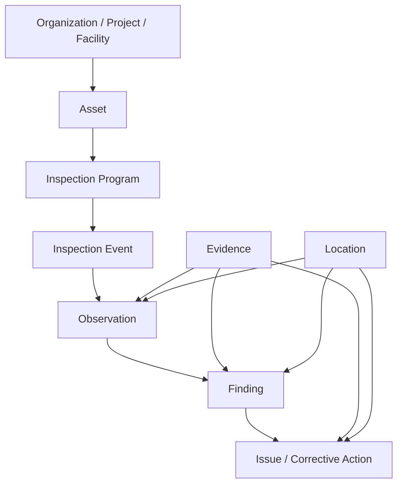

# Open Inspection Data Standard (OIDS)

> **Version 0.1.0 Public Working Draft — not a final standard**

The Open Inspection Data Standard (OIDS) is a vendor-neutral, publicly available data model and interoperability protocol for inspection information concerning buildings and other constructed assets.

OIDS is intended to let inspection, field-management, reality-capture, asset-management, and regulatory systems exchange inspection records without forcing participating products to use the same internal workflow.

T2D2 initiated and serves as the founding steward of this working draft. Permanent governance is intended to transition to a neutral, multi-stakeholder structure in accordance with [`GOVERNANCE.md`](GOVERNANCE.md).

## Version 0.1 priorities

Version 0.1 focuses on **vendor-to-vendor interoperability**. It defines:

- an asset-centered canonical data model;
- separate but related `Observation`, `Finding`, and `Issue` objects;
- nested parent-child grouping;
- evidence, location, provenance, authorship, and review records;
- recommended taxonomies with permanent identifiers and vendor extensions;
- modular JSON Schemas;
- standard API behaviors described with OpenAPI;
- high-level lifecycle events compatible with CloudEvents; and
- conformance roles for readers, writers, importers, exporters, and API providers.

Regulatory filing and advanced AI-specific profiles are future extensions. The core is designed so those extensions do not require a replacement data model.

## Core model



The links are flexible rather than strictly one-to-one:

- one observation can support multiple findings;
- one finding can be supported by multiple observations;
- one finding can generate zero or more issues;
- one issue can address multiple findings; and
- most entities may use `parentId` for groups, stamps, checklists, zones, or nested records.

## Repository contents

| Path | Purpose |
|---|---|
| [`specification/`](specification/) | Human-readable normative and explanatory specification |
| [`schemas/`](schemas/) | JSON Schema Draft 2020-12 modules |
| [`api/openapi.yaml`](api/openapi.yaml) | Standard API behaviors using OpenAPI 3.1 |
| [`events/`](events/) | Lifecycle event catalog and examples |
| [`profiles/`](profiles/) | Inspection-profile definitions |
| [`taxonomies/`](taxonomies/) | Recommended, extensible vocabulary registries |
| [`examples/`](examples/) | Complete example inspection packages |
| [`scripts/validate.py`](scripts/validate.py) | Local schema and repository validation |
| [`rfcs/`](rfcs/) | Proposals for material specification changes |
| [`decisions/`](decisions/) | Architecture and governance decision records |

## Get started

Clone the repository, install the development dependencies, and validate it:

```bash
python -m venv .venv
source .venv/bin/activate       # Windows: .venv\\Scripts\\activate
pip install -r requirements-dev.txt
python scripts/validate.py
```

A valid run ends with:

```text
Validation completed successfully.
```

Start with the complete example at [`examples/facade-inspection/package.json`](examples/facade-inspection/package.json).

## Status and versioning

This repository uses semantic versioning for published drafts. During the `0.x` period, breaking changes are expected and will be recorded in [`CHANGELOG.md`](CHANGELOG.md). A `1.0.0` release should not occur until there are multiple independent implementations and a documented interoperability test.

## Participation

Review [`CONTRIBUTING.md`](CONTRIBUTING.md), open a discussion or issue, submit a vendor mapping using [`templates/VENDOR_MAPPING.md`](templates/VENDOR_MAPPING.md), or propose a use case using [`templates/USE_CASE.md`](templates/USE_CASE.md).

Potential founding participants may review [`FOUNDING_PARTICIPANTS.md`](FOUNDING_PARTICIPANTS.md).

## Licenses

- Specification prose, diagrams, and documentation: **Creative Commons Attribution 4.0 International**; see [`LICENSE-DOCUMENTATION.md`](LICENSE-DOCUMENTATION.md).
- Schemas, API definitions, examples, scripts, and reference implementations: **Apache License 2.0**; see [`LICENSE`](LICENSE).

No implementation may imply certification, regulator approval, or endorsement merely because it uses this working draft.
